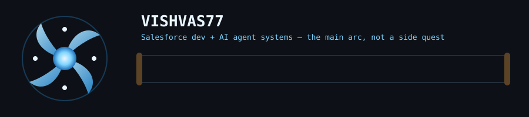
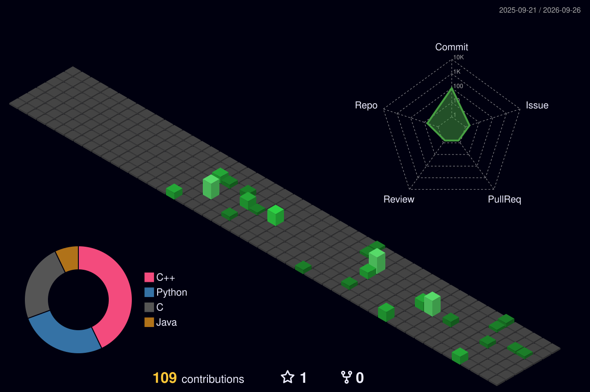

<!--
  TECHNIQUE: hand-authored SMIL SVG referenced via , not a typing-SVG header and not
  inlined raw <svg> markup. Referenced-as-image means GitHub serves it as a static asset
  instead of running it through the README HTML sanitizer, so the full SMIL animation
  (animateTransform, animate) survives untouched — that's the actual trick, not the Naruto skin.
-->

  

<!--
  TECHNIQUE: animated stroke-dashoffset divider instead of 
 or an emoji line, so every
  section reads as one continuous flow of chakra instead of stacked, disconnected widgets.
-->

  

## Rank Log

<!-- Ranks are gated on shipped repos, not on adjectives — a generic skills table can't be checked, a linked repo can. -->

| Rank | Unlocked by | What it actually proves |
|---|---|---|
| 🎓 Academy Student | [`java-programs`](https://github.com/Vishvas77/java-programs) · [`python-programs`](https://github.com/Vishvas77/python-programs) · C++ lab-programs | OOP, collections, JDBC, file handling, control flow, exceptions — the katas, not the mission |
| 🥋 Genin | [`memory-allocator-simulator`](https://github.com/Vishvas77/memory-allocator-simulator) (C) | First Fit / Best Fit / Worst Fit allocation, a visual memory map, fragmentation metrics, and a rule-based ranker — first solo mission into systems programming |
| ⚡ Chunin | AI research-matching assistant (Python) | RAG + LangGraph + vector search to match students with faculty and recommend research projects — the exam that requires combining jutsu, not executing one |
| 🌀 Jonin-track — *in progress* | Salesforce development + multi-agent AI pipelines shipped at hackathons | Ongoing. No rank-up ceremony for this one yet — still training |

  

## Training Grounds

<!--
  TECHNIQUE: github-profile-3d-contrib instead of a standard 2D contribution graph or a stat-card —
  an isometric render of real commit data is evidence of hours logged, not a decorative badge,
  and the accompanying Action means it stays current without a manual edit.
-->

  

95 contributions in the past year. 1 follower. Academy-level following, Genin-level output — the repos above carry this profile, the follower count doesn't.

## Current Arc

Two threads running in parallel, both deliberate, neither finished:

- **Salesforce development** — Apex, Flow, platform-native automation.
- **AI agent systems** — multi-agent pipelines built for hackathons (delay prediction, SLA-breach detection, network scoring on supply-chain use cases), plus RAG pipelines that reason over retrieval instead of just returning it.

No Jonin badge on this page. That rank isn't awarded, it's checked — look at the commit history above, not this paragraph.

---

Every rank in the table links to the repo that unlocked it. Unlinked claims don't go on this page.
