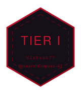
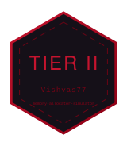

<div align="center">
  
</div>

<div align="center">
  
</div>

## VISHVAS77

`AI SYSTEMS · SALESFORCE · SYSTEMS`

I build AI systems — retrieval, orchestration, agents — plus the systems-level code beneath them. Salesforce platform work is my declared track; public evidence for it is still pending. This profile runs on one rule: **every claim resolves to a repository, or it does not ship.** Nothing here is self-certified.

<div align="center">
  
</div>

## CURRENT ARC · ACTIVE MISSION

> Work in flight. Nothing in this section is finished, ranked, or claimed — it trains in public until it ships.

<div align="center">
  
</div>

| field | value |
| --- | --- |
| `mission` | *[pending — the active build, named]* |
| `objective` | *[pending — what "done" looks like]* |
| `status` | `IN_PROGRESS` |
| `technology` | *[pending]* |
| `evidence` | *[pending — repository link lands here when the work is real]* |

<div align="center">
  
</div>

## STRONGEST PROJECTS

Every project on this profile is told in the same five beats — no exceptions, no adjectives without artifacts:

<div align="center">
  
</div>

### `ResearchCompass-AI`

| stage | entry |
| --- | --- |
| `PROJECT` | [ResearchCompass-AI](https://github.com/Vishvas77/ResearchCompass-AI#readme) — AI research-matching assistant · team project (Team AI For Good, credits in repo) |
| `TECHNOLOGY` | Python · LangChain (RAG) · LangGraph (workflow orchestration) · ChromaDB (vector DB) · OpenAI · Tavily (live search) · Semantic Scholar API |
| `PROBLEM` | Students have no structured way to discover matching faculty, research gaps, or collaboration opportunities |
| `RESULT` | Working CLI system with 12 documented capabilities — faculty recommendation, hybrid RAG semantic search, paper retrieval, research-gap analysis, outreach-email generation with a human-confirmation step |
| `EVIDENCE` | [README + source](https://github.com/Vishvas77/ResearchCompass-AI#readme) — install/run instructions, architecture, 8-commit history on `main` |

### `memory-allocator-simulator`

| stage | entry |
| --- | --- |
| `PROJECT` | [memory-allocator-simulator](https://github.com/Vishvas77/memory-allocator-simulator#readme) — C11 memory-management laboratory · team project (credits in repo) · MIT |
| `TECHNOLOGY` | C11 · doubly linked lists · GCC / Make · GitHub Actions CI · zero external dependencies |
| `PROBLEM` | Allocation strategies are usually taught as theory — first/best/worst-fit fragmentation behavior is rarely observable |
| `RESULT` | Working simulator: 3 allocation strategies, block splitting + coalescing, ASCII memory map, exact internal/external fragmentation metrics, workload-replay compare mode with a rule-based strategy ranker |
| `EVIDENCE` | [README + source](https://github.com/Vishvas77/memory-allocator-simulator#readme) — 26-commit history, CI workflows, MIT license in-repo |

<div align="center">
  
</div>

## ENGINEERING DEPTH

Depth is claimed only where evidence exists. Everything else stays open.

| domain | depth claim | evidence |
| --- | --- | --- |
| AI systems — RAG, agents, vector search | built a working RAG assistant with an orchestrated LangGraph workflow and vector database | [ResearchCompass-AI](https://github.com/Vishvas77/ResearchCompass-AI#readme) |
| systems programming — C11, allocators | built a modular allocator simulator with fragmentation metrics and strategy comparison | [memory-allocator-simulator](https://github.com/Vishvas77/memory-allocator-simulator#readme) |
| Core Java — OOP, Collections, Swing, JDBC | documented lab-exercise and mini-project collection | [java-programs](https://github.com/Vishvas77/java-programs) |
| Python fundamentals | documented lab-experiment collection | [python-programs](https://github.com/Vishvas77/python-programs) |
| C++ fundamentals | week-wise academic program archive | [cpp-programs](https://github.com/Vishvas77/cpp-programs) |
| Salesforce platform | declared track — repository evidence pending | *[pending]* |

<div align="center">
  
</div>

## EVIDENCE-GATED PROGRESSION

Ranks are outputs, not goals. A tier unlocks only when a real repository proves it — and each unlocked tier mints a hexagonal badge generated from the same design tokens as this page.

| tier | unlock requirement | status |
| --- | --- | --- |
| `TIER I` | one shipped repository with a documented PROBLEM → RESULT | `UNLOCKED` — [ResearchCompass-AI](https://github.com/Vishvas77/ResearchCompass-AI#readme) |
| `TIER II` | three repositories across distinct problems | `UNLOCKED` — [ResearchCompass-AI](https://github.com/Vishvas77/ResearchCompass-AI#readme) · [memory-allocator-simulator](https://github.com/Vishvas77/memory-allocator-simulator#readme) · [python-programs](https://github.com/Vishvas77/python-programs) |
| `TIER III` | sustained multi-repository track record, all evidence-linked | `LOCKED` |

<div align="center">
  
  &nbsp;&nbsp;
  
</div>

```text
badges emitted: 2 · policy: no repository, no badge
```

<div align="center">
  
</div>

## STACK / TOOLS

**Evidence-backed:**

`Python` · `LangChain` · `LangGraph` · `ChromaDB` · `OpenAI API` · `Tavily` · `Semantic Scholar API` · `C11` · `Java (Core · OOP · Collections · Swing · JDBC)` · `C++` · `GitHub Actions`

**Declared track, evidence pending:** `SALESFORCE PLATFORM`

<div align="center">
  
</div>

## LINKS

- [`github.com/VISHVAS77`](https://github.com/VISHVAS77)
- [`ResearchCompass-AI`](https://github.com/Vishvas77/ResearchCompass-AI) — AI research-matching assistant
- [`memory-allocator-simulator`](https://github.com/Vishvas77/memory-allocator-simulator) — C11 allocator laboratory
- [`java-programs`](https://github.com/Vishvas77/java-programs) · [`python-programs`](https://github.com/Vishvas77/python-programs) · [`cpp-programs`](https://github.com/Vishvas77/cpp-programs) — foundations collections

<div align="center">
  
</div>

## SYSTEM

This profile is a token-driven build for its generated components, with a supplied cinematic hero.

- `assets/hero/hero-poster.png` — the approved cinematic hero: a frame from `domain-cutscene.mp4` with `VISHVAS77` integrated into the scene
- `assets/hero/domain-cutscene.mp4` — master source for the local cinematic preview (`assets/hero/preview.html`)
- `design-tokens.json` — single source of truth for palette, typography, composition, budgets
- `scripts/build-tokens.mjs` — generates separators, identity, and badge SVGs from those tokens
- `.github/workflows/validate-hero.yml` — CI enforces asset integrity and README image references on every push

<details>
<summary>Static hero (GitHub profile view)</summary>
<br />

<div align="center">
  
</div>

On GitHub the profile shows this static cinematic poster. The full motion cutscene plays in the local preview (`assets/hero/preview.html`) and from the source `assets/hero/domain-cutscene.mp4`.

</details>

<details>
<summary>Build status</summary>

```text
hand-seal geometry : REFERENCE-DERIVED — reconstructed from 4-shot reference set
                    (front / three-quarter / side / fingertip-contact)
review log         : analysis/comparisons/hand-seal-gate.md
cinematic pass     : PHASE 2 LOCKED (8-frame render inspection)
rank badges        : 2 emitted — evidence-linked to unlocked tiers
shipped projects   : 2 flagship + 3 foundations collections ingested
current arc        : awaiting operator-declared in-progress work
```

</details>
